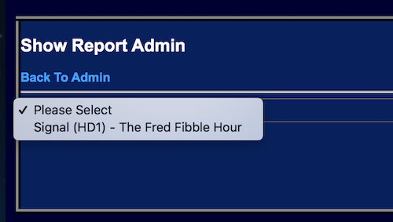
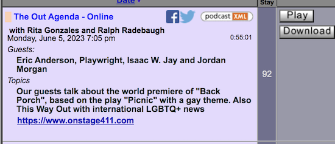

<!--
---
	title: Public File Enrty
	author: Otis Maclay <omaclay@gmail.com>
	date: Thu Jun  1 17:48:42 CDT 2023
---
-->
<!-- Create formatted output with one of these commands:
	pandoc --toc --standalone --self-contained -f markdown -t html -o pubfile.html  pubfile.md
	pandoc --toc --standalone --self-contained -f markdown -t latex -o pubfile.pdf pubfile.md
-->

# The Public File #

## FCC Requirements ##

Among other requirements, the FCC requires the posting of a Quarterly Issues
Report on the station&rsquo;s Public File. This report shows the station&rsquo;s
public affairs participation in the form of summaries of shows that were
broadcast. When there are no records kept of what topics the shows covered when
they were broadcast, it takes quite a lot of the Program Director&rsquo;s
(usually) time to assemble the report. Late or missing reports are subject to
fines and are easy for the FCC to notice.

## The Regulation ##

### Title 47 Subpart H &sect;73.3527(e)(8) ###

>Radio issues/programs lists   For nonexempt noncommercial educational broadcast stations, every three months a list of programs that have provided the station&rsquo;s most significant treatment of community issues during the preceding three month period. The list for each calendar quarter is to be filed by the tenth day of the succeeding calendar quarter (e.g., January 10 for the quarter October–December, April 10 for the quarter January–March, etc.). The list shall include a brief narrative describing what issues were given significant treatment and the programming that provided this treatment. The description of the programs shall include, but shall not be limited to, the time, date, duration, and title of each program in which the issue was treated. For the purposes of this section, exempt applicants, permittees, or licensees include those whose existing or prospective facilities are Class D FM stations or whose programming is wholly “Instructional”.

To be clear, a Class D station is one whose power output is no more than 10
watts. So all community radio stations are required to submit Quarterly Issue
Reports.

## The Confessor Public File Subsystem ##

The Pacifica Confessor includes functionality to support station staff and
volunteers to easily keep track of public affairs programming. This facility
also enables easy uploading to the FCC.

### How To Make a Pubfile Entry ###

Simple Instructions:

- Log in to your station&rsquo;s Confessor. If you don&rsquo;t have a login, get
  one from whoever gives out logins at your station. All you need is an email
  address.

- Navigate to &lsquo;Public File&rsquo;.

- Pick your show from the drop-down.

- Pick the date you&rsquo;re letting people know about.

- Click &lsquo;New Topic&rsquo;.

- Fill in the guest name (if any) and write a description of what you&rsquo;re
  going to talk about.

- Pick an &lsquo;Issue&rsquo; from the drop-down. (Usually there will be a
  default there appropriate for your show. Feel free to change it if it
  doesn&rsquo;t fit what you&rsquo;re doing on this particular show).

- Click &lsquo;Update&rsquo;.

- You&rsquo;re done.

### The Results ###

An entry in the pubfile system will show up in the archive like this:

If you enter the information before the show airs, it will show up on the weekly
schedule.

It will also appear in the &lsquo;Coming Soon&rsquo; window (if your station
implements it).

It will also appear in the Quarterly Issues Report so your Program Director (or
Public Affairs Director) doesn&rsquo;t have to chase you down to find out what
you did on your show.

And, if that weren&rsquo;t enough, you can correct all the typos in one place -
like the &lsquo;aa&rsquo; in &lsquo;probaably&rsquo;.

## Promoting Forward with the Confessor ##

Everything above can be done after your show has run. But....

It&rsquo;s well known in the radio game that you gain listeners by promoting
what you&rsquo;re doing on your show.

You&rsquo;ve spent hours during the week lining up a guest to talk about
something you know will affect your listeners and maybe make a difference. Is it
possible that there are people who may not be regular listeners who would, if
they knew about it, absolutely not miss your show? Would more listeners be a
good thing?

So you need to promote forward. It doesn&rsquo;t matter whether it&rsquo;s a
couple of weeks or a couple of days. Just letting people know what you&rsquo;re
doing makes it clear that you care. You&rsquo;re doing stuff that&rsquo;s worth
their time.

The confessor provides this capability. It takes only a minute or so of your
time to let people know your plans – who&rsquo;s going to be on the show and
what you&rsquo;re going to talk about.

## A Video of the Process ##

<iframe width="560" height="315" src="https://www.youtube.com/embed/F3U3_0HiUtw" title="YouTube video player" frameborder="0" allow="accelerometer; autoplay; clipboard-write; encrypted-media; gyroscope; picture-in-picture; web-share" allowfullscreen></iframe>
<!-- https://youtu.be/F3U3_0HiUtw -->
