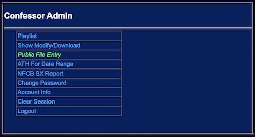
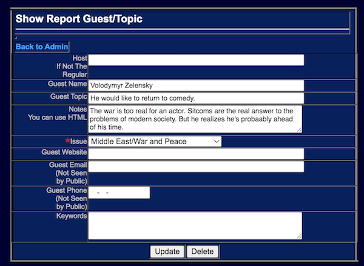

<!--
---
	title: Public File Enrty
	author: Otis Maclay <omaclay@gmail.com>
	date: Thu Jun  1 17:48:42 CDT 2023
---
-->
<!-- Create formatted output with one of these commands:
	pandoc --toc --standalone --self-contained -f markdown -t html -o pubfile.html  pubfile.md
	pandoc --toc --standalone --self-contained -f markdown -t latex -o pubfile.pdf pubfile.md
-->

# The Public File #

## FCC Requirements ##

Among other requirements, the FCC requires the posting of a Quarterly Issues Report on the station's Public File. This report shows
the station's public affairs participation in the form of summaries of shows that were broadcast.
When there are no records kept of what topics the shows covered when they were broadcast, it takes quite a lot of the
Program Director's (usually) time to assemble the report. Late or missing reports are subject to fines and are easy for
the FCC to notice.

## The Reg ##

### Title 47 Subpart H &sect;73.3527(e)(8) ###

>Radio issues/programs lists   For nonexempt noncommercial educational broadcast stations, every three months a list of programs that have provided the station's most significant treatment of community issues during the preceding three month period. The list for each calendar quarter is to be filed by the tenth day of the succeeding calendar quarter (e.g., January 10 for the quarter October–December, April 10 for the quarter January–March, etc.). The list shall include a brief narrative describing what issues were given significant treatment and the programming that provided this treatment. The description of the programs shall include, but shall not be limited to, the time, date, duration, and title of each program in which the issue was treated. For the purposes of this section, exempt applicants, permittees, or licensees include those whose existing or prospective facilities are Class D FM stations or whose programming is wholly “Instructional”.

For the record, a Class D station is one whose power output is no more than 10 watts. So we're all required to submit the Quarterly Issue Reports.

# The Confessor Public File Subsystem #

## How To Make a Pubfile Entry ##

Simple Instructions
- Log in to the confessor. If you don’t have a login, get one from whoever gives out logins at your station. All you need is an email address.

- Navigate to ‘Public File’.

- Pick your show from the drop-down.

- Pick the date you’re letting people know about.

- Click ‘New Topic’.

- Fill in the guest name (if any) and write a description of what you’re going to talk about. 

- Pick an ‘Issue’ from the drop-down. (Usually there will be a default there appropriate for your show. Feel free to change it if it doesn't fit what you're doing on this particular show).

- Click ‘Update’.

- You’re done.

### The Results ###

An entry in the pubfile system will show up in the archive like this:

If you enter the information before the show airs, it will show up on the weekly schedule.

It will also appear in the 'Coming Soon' window (if your station implements it).

<!--

-->

It will also appear in the Quarterly Issues Report so your PD doesn't have to chase you down to find out what you did on your show.

And, if that weren't enough, you can correct all the typos in one place - like the 'aa' in 'probaably'!

## Promoting Forward with the Confessor ##

Everything above can be done after your show has run. But....

It’s well known in the radio game that you gain listeners by promoting what you’re doing on your show. 

You’ve spent hours during the week lining up a guest to talk about something you know will affect your listeners and maybe make a difference. Is it possible that there are people who may not be regular listeners who would, if they knew about it, absolutely not miss your show? Would more listeners be a good thing?

So you need to promote forward. It doesn't matter whether it's a couple of weeks or a couple of days. Just letting people know what you’re doing makes it clear that you care.  You're doing stuff that’s worth their time.

The confessor provides this capability. It takes only a minute or so of your time to let people know your plans – who’s going to be on the show and what you’re going to talk about.

## This is a video of the process ##

<iframe width="560" height="315" src="https://www.youtube.com/embed/F3U3_0HiUtw" title="YouTube video player" frameborder="0" allow="accelerometer; autoplay; clipboard-write; encrypted-media; gyroscope; picture-in-picture; web-share" allowfullscreen></iframe>
<!-- https://youtu.be/F3U3_0HiUtw -->
